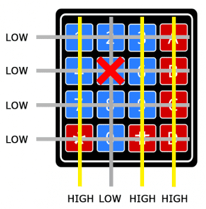
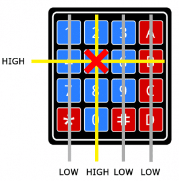
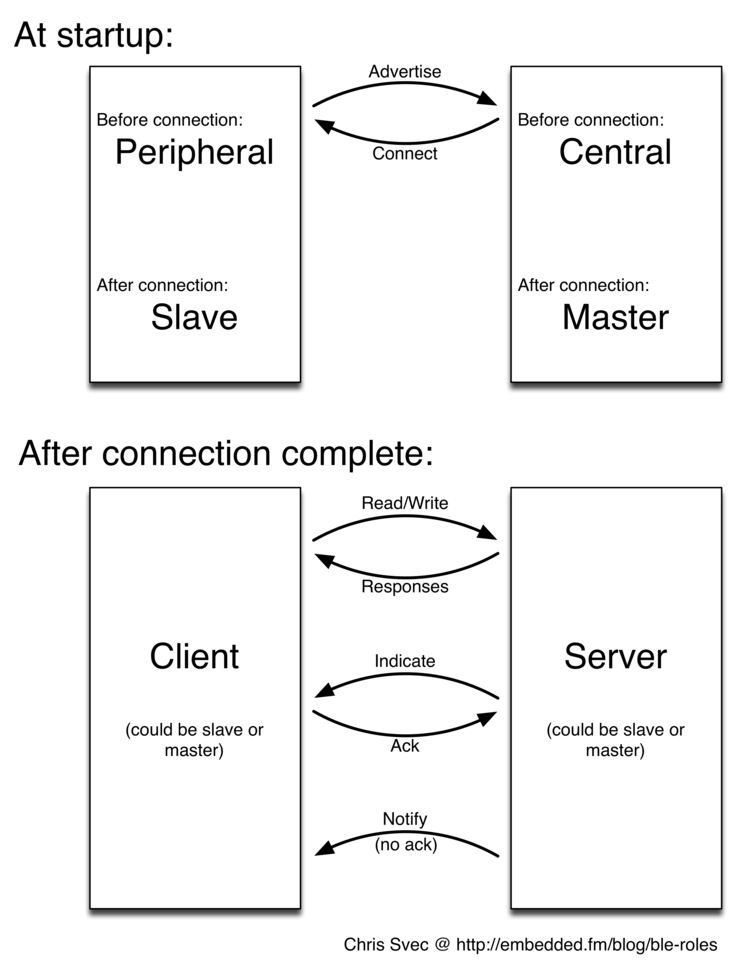
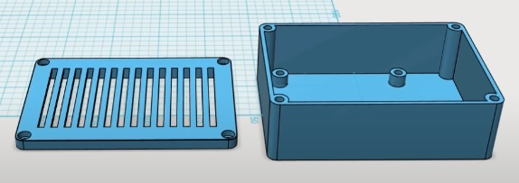
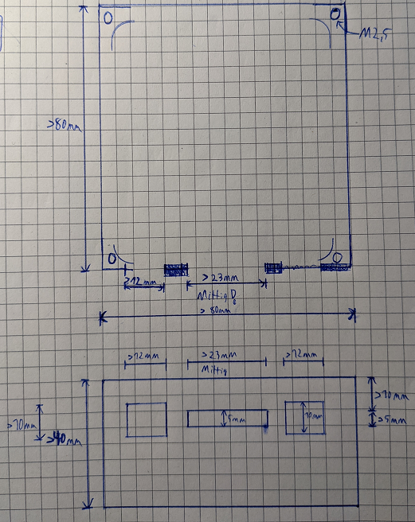
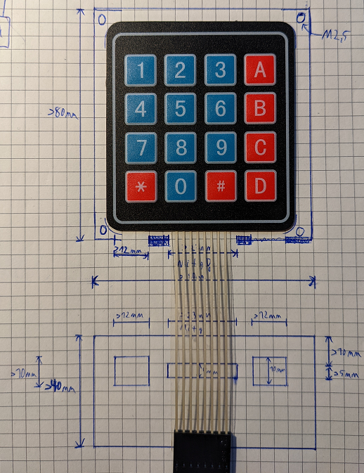

# RGB Bicycle  
https://learn.adafruit.com/adafruit-neopixel-uberguide/  
https://www.instructables.com/NeoPixel-Party-Bike-Music-Reactive-Animations-With/  

[1. Hardware Setup](#1-hardware-setup)  
[2. Measurements](#2-measurements)  
[3. Code](#3-code)  
[4. Input](#4-input)  
[5. Case](#5-case)  
[6. Animations](#6-animations)

---
# 1. Hardware Setup
Board: Arduino Nano  
install correct driver for the CH340 serial communication chip  
&rarr; https://learn.sparkfun.com/tutorials/how-to-install-ch340-drivers/all  

Processor: ATmega328P Old Bootloader  
&rarr; Port should be available  

same as Arduino Uno  
&rarr; 5V pins

RGB Stripes:  
- **ws2812b** (3 Wire, PWM)  
- APA102 (4 Wire, SPI)  

best practices:  
- add a large capacitor (>1000uF) between +/- of the power source  
- add a 300-500Ohm Restistor to the data line  

ToDo: add led strip light diffuser  
- [Flexible Diffusing Sleeve](https://www.alibaba.com/product-detail/Flexible-Diffusing-Sleeve-for-LED-Strip_60735604546.html)  
- https://s.click.aliexpress.com/e/ctKFn7htp  
- aliexpress.com/item/4000095850068.html  

---
# 2. Measurements  
## 2.1 WS2812B   
https://learn.adafruit.com/adafruit-neopixel-uberguide/arduino-library-use  

**Power Demand:**  
150 LEDS: every LED ~40ma  
+ each NeoPixel requires about 3 bytes of RAM: 450Bytes  

| COLOR/BRIGHTNESS | 10   | 50   | 100  | 150 | 200 | 250 |  
|------------------|------|------|------|-----|-----|-----|  
| RED              | 0.16 | 0.44 | 0.77 | 1.1 | 1.4 | 1.8 |  
| GREEN            | 0.16 | 0.44 | 0.77 | 1.1 | 1.4 | 1.8 |  
| BLUE             | 0.16 | 0.44 | 0.77 | 1.1 | 1.4 | 1.8 |  
| YELLOW           | 0.23 | 0.77 | 1.44 | 2.0 | 2.4 | 2.8 |  
| MAGENTA          | 0.23 | 0.77 | 1.44 | 2.0 | 2.4 | 2.7 |  
| CYAN             | 0.23 | 0.77 | 1.44 | 2.0 | 2.4 | 2.6 |  
| WHITE            | 0.3  | 1.1  | 2.0  | 2.5 | 2.9 | 3.1 |  

**Timings Salae:**  
transmit data takes ~30us per LED  
&rarr; updating 150 LEDs takes ~0.8ms set and ~4.5ms transmit = ~5.3ms per show() command   
&rarr; ~190 updates per second!!!  

optimize code: call show() only when all LED updated!  

## 2.2 AP102  
60 LEDs: 100ma!!!


--- 
# 3. Code
Libraries:  
- APA102
- NeoPixelBus by Makuna  
- **Adafruit NeoPixel**  


## 3.1 Adafruit NeoPixel Basics
https://adafruit.github.io/Adafruit_NeoPixel/html/index.html  

1. basic setup
```cpp
#include <Adafruit_NeoPixel.h>

#define LED_PIN   2
#define LED_COUNT 150

// Declare our NeoPixel strip object:
Adafruit_NeoPixel strip(LED_COUNT, LED_PIN, NEO_GRB + NEO_KHZ800);

void setup() {
  Serial.begin(115200);
  strip.begin();
  strip.show(); // Initialize all pixels to 'off'
  Serial.println("Running...");
}
```

2. set pixel color  
```cpp
// n = pixel number along the strip starting with 0
// pixel color rgb brightness levels: 0 is dimmest (off) and 255 maximum brightness  
strip.setPixelColor(n, red, green, blue);

// alternative: sometimes easier and faster: color 32-bit type
uint32_t magenta = strip.Color(255, 0, 255);
strip.setPixelColor(n, color);  
```

3. update pixel  
```cpp
// push color data to the strip
// -> update the whole strip at once
strip.show();

// set multiple pixel to the same 32-bit RGB color value:  
strip.fill(color, first, count);

// turn LEDs “off”
strip.clear();
```

other methods: query existing strips objects  
```cpp
// query the color of a previously-set pixel
uint32_t color = strip.getPixelColor(11);

// number of pixels in a previously-declared strip
uint16_t n = strip.numPixels();
```

## 3.2 FastLED Basics
http://fastled.io/  

FUNCTION-BASED ANIMATION SEQUENCES:  
https://gist.github.com/hsiboy/f9ef711418b40e259b06  


## 3.3 Colors  

### 3.3.1 Simple RGB Colors
a) fixed brightness:  
```cpp
#define BRIGHTNESS 150
#define OFF Adafruit_NeoPixel::Color(0, 0, 0)
#define RED Adafruit_NeoPixel::Color(BRIGHTNESS, 0, 0)
#define GREEN Adafruit_NeoPixel::Color(0, BRIGHTNESS, 0)
#define BLUE Adafruit_NeoPixel::Color(0, 0, BRIGHTNESS)
#define YELLOW Adafruit_NeoPixel::Color(BRIGHTNESS, BRIGHTNESS, 0)
#define MAGENTA Adafruit_NeoPixel::Color(BRIGHTNESS, 0, BRIGHTNESS)
#define CYAN Adafruit_NeoPixel::Color(0, BRIGHTNESS, BRIGHTNESS)
#define WHITE Adafruit_NeoPixel::Color(BRIGHTNESS, BRIGHTNESS, BRIGHTNESS)
```

b) macro brightness:  
```cpp
#define RED(brightness) Adafruit_NeoPixel::Color(brightness, 0, 0)
#define GREEN(brightness) Adafruit_NeoPixel::Color(0, brightness, 0)
#define BLUE(brightness) Adafruit_NeoPixel::Color(0, 0, brightness)
#define YELLOW(brightness) Adafruit_NeoPixel::Color(brightness, brightness, 0)
#define MAGENTA(brightness) Adafruit_NeoPixel::Color(brightness, 0, brightness)
#define CYAN(brightness) Adafruit_NeoPixel::Color(0, brightness, brightness)
#define WHITE(brightness) Adafruit_NeoPixel::Color(brightness, brightness, brightness)
```

### 3.3.2 HSV Colors
https://alloyui.com/examples/color-picker/hsv.html  
&rarr; google color picker: HSV    

```cpp
/* Convert hue, saturation and value into a packed 32-bit RGB color that can be passed to setPixelColor() or other RGB-compatible functions. */
uint32_t Adafruit_NeoPixel::ColorHSV	(	
  uint16_t 	hue,
  uint8_t 	sat = 255,
  uint8_t 	val = 255 
);		

/* A gamma-correction function for 32-bit packed RGB or WRGB colors. Makes color transitions appear more perceptially correct. */
uint32_t Adafruit_NeoPixel::gamma32	(	uint32_t 	x	);	
```

Parameters:
- **hue**  	
  An unsigned 16-bit value, 0 to 65535, representing one full loop of the color wheel, which allows 16-bit hues to "roll over" while still doing the expected thing (and allowing more precision than the wheel() function that was common to prior NeoPixel examples).
- **sat =	Saturation**  
  8-bit value, 0 (min or pure grayscale) to 255 (max or pure hue). Default of 255 if unspecified.
- **val =	brightness**  
  8-bit value, 0 (min / black / off) to 255 (max or full brightness). Default of 255 if unspecified.

Returns 32-bit RGB color:  
Result is linearly but not perceptually correct  
&rarr; pass the result through the gamma32() function   
Diffusing the LEDs also really seems to help when using low-saturation colors.

**a) fixed brightess:**  
```cpp
#define BRIGHTNESS 150
#define SATURATION 255
#define HUE_DEGREE 182  // 65535 / 360 = 182.0417

#define OFF     Adafruit_NeoPixel::ColorHSV(0, 0, 0)
#define WHITE   Adafruit_NeoPixel::ColorHSV(0, 0, BRIGHTNESS)
#define COLOR(degree) Adafruit_NeoPixel::ColorHSV(degree*HUE_DEGREE, SATURATION, BRIGHTNESS)
#define RED     Adafruit_NeoPixel::ColorHSV(0*HUE_DEGREE, SATURATION, BRIGHTNESS) 
#define YELLOW  Adafruit_NeoPixel::ColorHSV(60*HUE_DEGREE, SATURATION, BRIGHTNESS)   // 10920 vs. 10922
#define GREEN   Adafruit_NeoPixel::ColorHSV(120*HUE_DEGREE, SATURATION, BRIGHTNESS)  // 21840 vs. 21845
#define CYAN    Adafruit_NeoPixel::ColorHSV(180*HUE_DEGREE, SATURATION, BRIGHTNESS)  // 32760 vs. 32767
#define BLUE    Adafruit_NeoPixel::ColorHSV(240*HUE_DEGREE, SATURATION, BRIGHTNESS)  // 43680 vs. 43690
#define MAGENTA Adafruit_NeoPixel::ColorHSV(300*HUE_DEGREE, SATURATION, BRIGHTNESS)  // 54600 vs. 54612
```

**b) macro brightness:**  
```cpp
#define SATURATION 255
#define HUE_DEGREE 182

#define OFF                 Adafruit_NeoPixel::ColorHSV(0, 0, 0)
#define WHITE(brightness)   Adafruit_NeoPixel::ColorHSV(0, 0, brighness)
#define COLOR(degree, brightness) Adafruit_NeoPixel::ColorHSV(degree*HUE_DEGREE, SATURATION, brightness)
#define RED(brightness)     Adafruit_NeoPixel::ColorHSV(0*HUE_DEGREE, SATURATION, brighness)
#define YELLOW(brightness)  Adafruit_NeoPixel::ColorHSV(60*HUE_DEGREE, SATURATION, brighness)
#define GREEN(brightness)   Adafruit_NeoPixel::ColorHSV(120*HUE_DEGREE, SATURATION, brighness)
#define CYAN(brightness)    Adafruit_NeoPixel::ColorHSV(180*HUE_DEGREE, SATURATION, brighness)
#define BLUE(brightness)    Adafruit_NeoPixel::ColorHSV(240*HUE_DEGREE, SATURATION, brighness)
#define MAGENTA(brightness) Adafruit_NeoPixel::ColorHSV(300*HUE_DEGREE, SATURATION, brighness)

```

**c) pass only hue:**  
&rarr; requires special handling for OFF and WHITE  
```cpp
#define BRIGHTNESS 150
#define HUE_DEGREE 182

#define COLOR(degree) degree*HUE_DEGREE
#define RED        0*HUE_DEGREE
#define YELLOW     60*HUE_DEGREE
#define GREEN      120*HUE_DEGREE
#define CYAN       180*HUE_DEGREE
#define BLUE       240*HUE_DEGREE
#define MAGENTA    300*HUE_DEGREE
```


**brightness steps:**  
0 5 10 20 30 50 75 100 150 200 255  

## 3.4 NeoPixelHelper
additional library to split strip into multiple Segments  
&rarr; built on top of Adafruit_NeoPixel  

```cpp
#include <Adafruit_NeoPixel.h>

#define HUE_DEGREE 182
#define OFF Adafruit_NeoPixel::Color(0, 0, 0)

struct Segment {
  uint8_t first;
  uint8_t count;
};

class SegmentedStrip : public Adafruit_NeoPixel {
  public:
    // constructor
    SegmentedStrip(uint16_t n, uint16_t p, neoPixelType t, uint8_t segment_starts[], uint8_t n_segments);

    // public attributes
    // numLEDs -> given by parent class

    // public methods
    // defaults always go in the header file!
    // complete strip
    void update(void);
    void setStripe(uint32_t color);
    void setStripeForeground(void);
    void setStripeBackground(void);
    void resetStripe(void);
    
    void shiftColorStripe(uint16_t color_degree_frame_step, uint16_t animation_frames);

    // segments
    void setSegments(uint32_t active_segments);
    void setSegments(uint32_t color, uint32_t active_segments);
    void resetSegments(uint32_t active_segments);
    void setAllSegments(uint32_t color);  
    void setEvenSegments(uint32_t color);  
    void setOddSegments(uint32_t color);  
    void setFirstSegments(uint32_t color, uint8_t n);
    void setLastSegments(uint32_t color, uint8_t n);

    void blinkSegments(uint32_t color, uint32_t active_segments, uint16_t frames, uint16_t frame_color_switch=0);
    void blinkSegments(uint32_t color1, uint32_t color2, uint32_t active_segments, uint16_t frames, uint16_t frame_color_switch=0);
    void blinkAllSegments(uint32_t color1, uint32_t color2, uint16_t frames, uint16_t frame_color_switch=0);
    void blinkEvenSegments(uint32_t color1, uint32_t color2, uint16_t frames, uint16_t frame_color_switch=0);
    void blinkOddSegments(uint32_t color1, uint32_t color2, uint16_t frames, uint16_t frame_color_switch=0);
    void blinkFirstSegments(uint32_t color1, uint32_t color2, uint8_t n, uint16_t frames, uint16_t frame_color_switch=0);
    void blinkLastSegments(uint32_t color1, uint32_t color2, uint8_t n, uint16_t frames, uint16_t frame_color_switch=0);

    void shiftSegments(uint32_t color, uint32_t active_segments, uint32_t init_segments, int8_t shift_segments, uint16_t frames, uint16_t animation_frames);
    void shiftSegments(uint32_t color1, uint32_t color2, uint32_t active_segments, uint32_t init_segments, int8_t shift_segments, uint16_t frames, uint16_t animation_frames);

    // segments pixel pattern
    void setPattern(uint32_t color, uint32_t active_segments, uint32_t active_pixel);
  
    void blinkPattern(uint32_t color1, uint32_t color2, uint32_t active_segments, uint32_t active_pixel, uint16_t frames, uint16_t frame_color_switch=0);

    void shiftPattern(uint32_t color, uint32_t active_segments, uint32_t init_pixel, int8_t shift_pixel, uint16_t frames, uint16_t animation_frames);
    void shiftPattern(uint32_t color1, uint32_t color2, uint32_t active_segments, uint32_t init_pixel, int8_t shift_pixel, uint16_t frames, uint16_t animation_frames);
    void shiftPatternInit(uint32_t color, uint32_t active_segments, uint32_t pixel_pattern, int8_t init_shift_pixel, int8_t shift_pixel, uint16_t frames, uint16_t animation_frames);
    void shiftPatternInit(uint32_t color1, uint32_t color2, uint32_t active_segments, uint32_t pixel_pattern, int8_t init_shift_pixel, int8_t shift_pixel, uint16_t frames, uint16_t animation_frames);

    // play with colors
    void setColorSteps(uint16_t color_degree_start, uint16_t color_degree_step, uint32_t active_segments);
    void setColorSteps(uint16_t color_degree_start, uint8_t saturation_start, uint8_t saturation_step, uint32_t active_segments);
    void setColorSteps(uint16_t color_degree_start, uint16_t color_degree_step, uint8_t saturation_start, uint8_t saturation_step, uint32_t active_segments);
    
    void shiftColorSteps(uint16_t color_degree_start, uint16_t color_degree_step, uint32_t active_segments, uint16_t color_degree_frame_step, uint16_t animation_frames);
    void shiftColorSteps(uint16_t color_degree_start, uint8_t saturation_start, uint8_t saturation_step, uint32_t active_segments, uint8_t saturation_frame_step, uint16_t animation_frames);
    void shiftColorSteps(uint16_t color_degree_start, uint16_t color_degree_step, uint8_t saturation_start, uint8_t saturation_step, uint32_t active_segments, uint16_t color_degree_frame_step, uint8_t saturation_frame_step, uint16_t animation_frames);
    
    void animateSegmentsRainbow(uint16_t color_degree_start, uint16_t color_degree_led_step, uint32_t active_segments, uint16_t color_degree_frame_step, uint16_t animation_frames);
    void animateRainbowStripe(uint16_t color_degree_start, uint16_t color_degree_frame_step, uint16_t animation_frames);
    void animateRainbowLEDs(uint16_t color_degree_start, uint16_t color_degree_led_step, uint16_t color_degree_frame_step, uint16_t animation_frames);

    // colors
    uint32_t color(uint16_t degree);
    uint32_t color(uint16_t degree, uint8_t saturation);
    uint32_t WHITE(void);
    uint32_t RED(void);
    uint32_t YELLOW(void);
    uint32_t GREEN(void);
    uint32_t CYAN(void);
    uint32_t BLUE(void);
    uint32_t MAGENTA(void);

    // public getters
    Segment* getSegments();
    uint8_t getNSegments();
    uint8_t getLongestSegment();
    uint32_t getFrameCounter();
    uint8_t getBrightness();
    uint16_t getColorDegreeForeground();
    uint16_t getColorDegreeBackground();
    uint32_t getColorForeground();
    uint32_t getColorBackground();
    uint8_t getSaturation();
    uint8_t getDelay();

    uint32_t getAllSegments();
    uint32_t getEvenSegments();
    uint32_t getOddSegments();
    uint32_t getFirstSegments(uint8_t n);
    uint32_t getLastSegments(uint8_t n);
    uint32_t getAllPixels();
    uint32_t getEvenPixels();
    uint32_t getOddPixels();
    uint32_t getFirstPixels(uint8_t n);
    uint32_t getLastPixels(uint8_t n);
    
    // public setters
    void resetFrameCounter(void);
    void setBrightness(uint8_t);
    void increaseBrightness(uint8_t b);
    void decreaseBrightness(uint8_t b);
    void increaseBrightnessStep(void);
    void decreaseBrightnessStep(void);
    void increaseColorDegreeForeground(uint16_t c);
    void decreaseColorDegreeForeground(uint16_t c);
    void increaseColorDegreeBackground(uint16_t c);
    void decreaseColorDegreeBackground(uint16_t c);
    void setSaturation(uint8_t s);
    void increaseDelay(uint8_t d);
    void decreaseDelay(uint8_t d);


  private:
    // private attributes
    Segment *segments;  // extract array of Segments elements from array of segment_starts
    uint8_t n_segments;
    uint8_t longest_segment;  // n_pixels in the longest segment
    uint32_t frame_counter = 0;
    uint8_t brightness = 100;
    uint8_t brightnessSteps[11] = {0, 5, 10, 20, 30, 50, 75, 100, 150, 200, 255};
    uint8_t nBrightnessSteps = 10;  // -1: do not count 0!
    uint8_t brightnessStep = 5;
    uint16_t colorDegreeForeground = 0;
    uint16_t colorDegreeBackground = 0;
    uint8_t saturation = 255;
    uint8_t delay = 0;

    uint8_t MAX_NUMBER_SEGMENTS       = 32;
    uint8_t MAX_NUMBER_SEGMENT_PIXELS = 32;
    uint32_t ALL_SEGMENTS;  // binary representations
    uint32_t EVEN_SEGMENTS;
    uint32_t ODD_SEGMENTS;
    uint32_t ALL_PIXELS;  // given by longest_segment!!!
    uint32_t EVEN_PIXELS;
    uint32_t ODD_PIXELS;

    // private methods
    void update_segments(uint8_t segment_starts[]);
    void update_longest_segment();
};
```


---
# 4. Input
## 4.1 Keypad

https://www.circuitbasics.com/how-to-set-up-a-keypad-on-an-arduino/  

**Principle:**  
  

0. all columns held high, all rows low    
1. button press: pulls column of the button low  
    

2. find the row: switch each row HIGH an read columns  
  &rarr; when column is low: detected the row  
    


**Keypad Library for Arduino:**  
Authors:  Mark Stanley, Alexander Brevig  
https://playground.arduino.cc/Code/Keypad/  

```cpp
#include <Keypad.h>

const byte ROWS = 4; 
const byte COLS = 4; 

char hexaKeys[ROWS][COLS] = {
  {'1', '2', '3', 'A'},
  {'4', '5', '6', 'B'},
  {'7', '8', '9', 'C'},
  {'*', '0', '#', 'D'}
};

byte rowPins[ROWS] = {5, 6, 7, 8};  // {12, 11, 10, 9}; 
byte colPins[COLS] = {9, 10, 11, 12};  // {8, 7, 6, 5};

Keypad customKeypad = Keypad(makeKeymap(hexaKeys), rowPins, colPins, ROWS, COLS); 

void setup(){
  Serial.begin(115200);
}
  
void loop(){
  char customKey = customKeypad.getKey();
  
  if (customKey){
    Serial.println(customKey);
  }
}
```

**SegmentsKeypad:**  
- */#: decrease/increase Brightness by 10  
- A-D: select animation set  
- 0-9: set animation  
  &rarr; 40 different animations

```cpp
char animationMode = '1';
char animationSet  = 'A';

void updateKeypad(void) {
  // 1. get keypad input
  char customKey = customKeypad.getKey();
  
  // 2. only update settings if key pressed
  if (customKey) {
    // 2.1 print keypad debug output:
    Serial.print(segmentStrip1.getFrameCounter());
    Serial.print(' ');
    Serial.print(customKey);
    Serial.print(' ');

    // 2.2. update settings
    switch(customKey) {
      case '*':
        // */#: update brightenss or frequency
        applyAsteriks();
        break;
      case '#':
        // */#: update brightenss or frequency
        applyHashkey();
        break;
      case 'A':
      case 'B':
      case 'C':
      case 'D':
        // A-D: update animationSet
        animationSet = customKey;
        break;
      case '0':
      case '1':
      case '2':
      case '3':
      case '4':
      case '5':
      case '6':
      case '7':
      case '8':
      case '9':
        // 0-9: update animationMode
        animationMode = customKey;
        break;
      default:
        // do nothing
        break;
    }

    // reset current pixels
    segmentStrip1.resetStripe();
    segmentStrip2.resetStripe();

    Serial.println();  // keypad debug output: end line
  }
}

void applyAsteriks(void) {
  switch(animationSet) {
    case 'A':
      // A: decrease color foreground
      segmentStrip1.decreaseColorDegreeForeground(COLORDEGREECHANGE);
      segmentStrip2.decreaseColorDegreeForeground(COLORDEGREECHANGE);
      break;
    case 'B':
      // B: decrease brightness
      // segmentStrip1.decreaseBrightness(10);
      // segmentStrip2.decreaseBrightness(10);
      segmentStrip1.decreaseBrightnessStep();
      segmentStrip2.decreaseBrightnessStep();
      Serial.print(segmentStrip1.getBrightness());
      break;
    case 'C':
      // C: decrease color background
      segmentStrip1.decreaseColorDegreeBackground(COLORDEGREECHANGE);
      segmentStrip2.decreaseColorDegreeBackground(COLORDEGREECHANGE);
      break;
    case 'D':
      // D: decrease delay
      segmentStrip1.decreaseDelay(DELAYCHANGE);
      segmentStrip2.decreaseDelay(DELAYCHANGE);
      Serial.print(segmentStrip1.getDelay());
      break;
    default:
      // do nothing
      break;
  }
}

void applyHashkey(void) {
  switch(animationSet) {
    case 'A':
      // A: increase color foreground
      segmentStrip1.increaseColorDegreeForeground(COLORDEGREECHANGE);
      segmentStrip2.increaseColorDegreeForeground(COLORDEGREECHANGE);
      break;
    case 'B':
      // B: increase brightness
      // segmentStrip1.increaseBrightness(10);
      // segmentStrip2.increaseBrightness(10);
      segmentStrip1.increaseBrightnessStep();
      segmentStrip2.increaseBrightnessStep();
      Serial.print(segmentStrip1.getBrightness());
      break;
    case 'C':
      // C: increase color background
      segmentStrip1.increaseColorDegreeBackground(COLORDEGREECHANGE);
      segmentStrip2.increaseColorDegreeBackground(COLORDEGREECHANGE);
      break;
    case 'D':
      // D: increase delay
      segmentStrip1.increaseDelay(DELAYCHANGE);
      segmentStrip2.increaseDelay(DELAYCHANGE);
      Serial.print(segmentStrip1.getDelay());
      break;
    default:
      // do nothing
      break;
  }
}

void applyPattern(void) {
  switch(animationSet) {
    case 'A':
      applyPatternA();
      break;
    case 'B':
      applyPatternB();
      break;
    case 'C':
      applyPatternC();
      break;
    case 'D':
      applyPatternD();
      break;
    default:
      // do nothing
      break;
  }
}
```

---
## 4.2 BLE
### 4.2.1 BLE Roles
https://embedded.fm/blog/ble-roles  
https://web.archive.org/web/20160930015609/http://projects.mbientlab.com:80/bluetooth-low-energy-basics/  

pre-connection vs. post-connection  
1. **Pre-connection:**  
  At startup a device is either a peripheral or a central  
  - **Peripheral:** advertises itself and waits for a central to connect to it  
    a peripheral is usually a small device like a Fitbit or smart watch  
    &rarr; a peripheral that made a connection is a **Slave**  
  - **Central:** scans for other devices  
    a central is usually a smartphone or a PC  
    &rarr; a central that made a connection is a **Master**  

2. **Post-connection:**  
  After a BLE connection has been established, devices can be either a client or a server  
  - **Client:** access remote resources  
    usually the master, but could also be the slave  
  - **Server:** has a local database of resources, provide resource to clients  
    usually the slave, but could also be the master  

  
use read, write, notify, or indicate operations to move data between the client and the server:  
a) client send read/write operations to the server  
  &rarr; the server responds with data/changes data  
b) server send data to the client  
  &rarr; indicate operations: ack by client  
  &rarr; notify operations: no ack by client  

A device can switch between a Master and Slave but it cannot be both at the same time.  
A device can be a Server and Client at the same time.  


### 4.2.1 Arduino Nano 33 BLE
https://www.arduino.cc/en/Guide/NANO33BLE  
ToDo!  


---
## 4.3 Infrared
Sensor: TSOP4838  
Arduino Library: [IRemote](https://github.com/Arduino-IRremote/Arduino-IRremote)  
[project homepage](https://arduino-irremote.github.io/Arduino-IRremote/)  
[wiki](https://github.com/Arduino-IRremote/Arduino-IRremote/wiki)  
[Problem: IRemote and NeoPixel](http://marc.merlins.org/perso/arduino/post_2017-04-03_Arduino-328P-Uno-Teensy3_1-ESP8266-ESP32-IR-and-Neopixels.html)  

Protocols can be switched off and on by definining macros before the line #incude <IRremote.h>  
`#define DECODE_NEC`  

**remote control codes:**  
| column 1   | column 2    | column 3   |  
|------------|-------------|------------|  
| CH- = 0x45 | CH = 0x46   | CH+ = 0x47 |  
| |<< = 0x44 | >>| = 0x40  | >|| = 0x43 |  
| - = 0x7    | + = 0x15    | EQ = 0x9   |  
| 0 = 0x16   | 100+ = 0x19 | 200+ = 0xD |  
| 1 = 0xC    | 2 = 0x18    | 3 = 0x5E   |  
| 4 = 0x8    | 5 = 0x1C    | 6 = 0x5A   |  
| 7 = 0x42   | 8 = 0x52    | 9 = 0x4A   |  
  
```cpp  
#define CHM 0x45
#define CH  0x46
#define CHP 0x47
#define LEFT 0x44
#define RIGHT 0x40
#define PLAY_PAUSE 0x43
#define MINUS 0x7
#define PLUS 0x15
#define EQ 0x9
#define ZERO 0x16
#define HUNDRED 0x19
#define HUNDRED2 0xD
#define ONE 0xC
#define TWO 0x18
#define THREE 0x5E
#define FOUR 0x8
#define FIVE 0x1C
#define SIX 0x5A
#define SEVEN 0x42
#define EIGHT 0x52
#define NINE 0x4A
```


---
# 5. Case
- power arduino: usb-micro cable from power bank into the case  
- keypad: Flat Cables from top of case into the case (centered: 5*23mm)  
- Stripe:  
  a) data: adapter cable from stripe into the case(data+GND)  
  b) power: usb-cable from power bank to stripe (VCC+GND)  

  
  
  


# 6. Animations
```cpp
// 1. blink complete segments
// blink all Segments
segmentStrip1.blinkSegments(segmentStrip1.getColorForeground(), segmentStrip1.getAllSegments(), 200);
segmentStrip2.blinkSegments(segmentStrip2.getColorForeground(), segmentStrip2.getAllSegments(), 200);

// blink even Segments
segmentStrip1.blinkSegments(segmentStrip1.getColorForeground(), segmentStrip1.getEvenSegments(), 200);
segmentStrip2.blinkSegments(segmentStrip2.getColorForeground(), segmentStrip2.getEvenSegments(), 200);

// blink odd Segments
segmentStrip1.blinkSegments(segmentStrip1.getColorForeground(), segmentStrip1.getOddSegments(), 200);
segmentStrip2.blinkSegments(segmentStrip2.getColorForeground(), segmentStrip2.getOddSegments(), 200);

// blink first 3 Segments
segmentStrip1.blinkSegments(segmentStrip1.getColorForeground(), segmentStrip1.getFirstSegments(3), 200);
segmentStrip2.blinkSegments(segmentStrip2.getColorForeground(), segmentStrip2.getFirstSegments(3), 200);

// blink last 3 Segments
segmentStrip1.blinkSegments(segmentStrip1.getColorForeground(), segmentStrip1.getLastSegments(3), 200);
segmentStrip2.blinkSegments(segmentStrip2.getColorForeground(), segmentStrip2.getLastSegments(3), 200);

// blink all Segments (background)
segmentStrip1.blinkAllSegments(segmentStrip1.getColorForeground(), segmentStrip1.getColorBackground(), 200);
segmentStrip2.blinkAllSegments(segmentStrip2.getColorForeground(), segmentStrip2.getColorBackground(), 200);

// blink even Segments (background)
segmentStrip1.blinkEvenSegments(segmentStrip1.getColorForeground(), segmentStrip1.getColorBackground(), 200);
segmentStrip2.blinkEvenSegments(segmentStrip2.getColorForeground(), segmentStrip2.getColorBackground(), 200);

// blink odd Segments (background)
segmentStrip1.blinkOddSegments(segmentStrip1.getColorBackground(), segmentStrip1.getColorForeground(), 200);
segmentStrip2.blinkOddSegments(segmentStrip2.getColorBackground(), segmentStrip2.getColorForeground(), 200);

// blink first 3 Segments (background)
segmentStrip1.blinkFirstSegments(segmentStrip1.getColorForeground(), segmentStrip1.getColorBackground(), 3, 200);
segmentStrip2.blinkFirstSegments(segmentStrip2.getColorForeground(), segmentStrip2.getColorBackground(), 3, 200);

// blink last 3 Segments (background)
segmentStrip1.blinkLastSegments(segmentStrip1.getColorForeground(), segmentStrip1.getColorBackground(), 3, 200);
segmentStrip2.blinkLastSegments(segmentStrip2.getColorForeground(), segmentStrip2.getColorBackground(), 3, 200);

// blink 25/75  duty cycle -> repeat after 200 ticks: 50 ticks color1, remaining 150 ticks color2
segmentStrip1.blinkSegments(segmentStrip1.getColorForeground(), segmentStrip1.getColorBackground(), segmentStrip1.getAllSegments(), 200, 50);
segmentStrip2.blinkSegments(segmentStrip2.getColorForeground(), segmentStrip2.getColorBackground(), segmentStrip2.getAllSegments(), 200, 50);

// blink alternating on each side
segmentStrip1.blinkAllSegments(segmentStrip1.getColorForeground(), segmentStrip1.getColorBackground(), 200);
segmentStrip2.blinkAllSegments(segmentStrip2.getColorBackground(), segmentStrip2.getColorForeground(), 200);


// 2. shift complete segments
// animate Segments (background)
segmentStrip1.shiftSegments(segmentStrip1.getColorForeground(), segmentStrip1.getColorBackground(), segmentStrip1.getAllSegments(), 0x1, 1, 250, 50);
segmentStrip2.shiftSegments(segmentStrip2.getColorForeground(), segmentStrip2.getColorBackground(), segmentStrip2.getAllSegments(), 0x1, 1, 250, 50);

// animate Segments (background, reversed)
segmentStrip1.shiftSegments(segmentStrip1.getColorForeground(), segmentStrip1.getColorBackground(), segmentStrip1.getAllSegments(), segmentStrip1.getLastSegments(1), -1, 250, 50);
segmentStrip2.shiftSegments(segmentStrip2.getColorForeground(), segmentStrip2.getColorBackground(), segmentStrip2.getAllSegments(), segmentStrip2.getLastSegments(1), -1, 250, 50);

// animate segments without background
segmentStrip1.shiftSegments(segmentStrip1.getColorForeground(), segmentStrip1.getAllSegments(), 0x1, 1, 300, 60); 
segmentStrip2.shiftSegments(segmentStrip2.getColorForeground(), segmentStrip2.getAllSegments(), 0x1, 1, 300, 60);

// animate segments without background (reversed)
segmentStrip1.shiftSegments(segmentStrip1.getColorForeground(), segmentStrip1.getAllSegments(), segmentStrip1.getLastSegments(1), -1, 300, 60); 
segmentStrip2.shiftSegments(segmentStrip2.getColorForeground(), segmentStrip2.getAllSegments(), segmentStrip2.getLastSegments(1), -1, 300, 60);


// 3. blink pixel pattern of segments
// all segments, all pixels
segmentStrip1.blinkPattern(segmentStrip1.getColorForeground(), segmentStrip1.getColorBackground(), segmentStrip1.getAllSegments(), segmentStrip1.getAllPixels(), 200);  
segmentStrip2.blinkPattern(segmentStrip2.getColorForeground(), segmentStrip2.getColorBackground(), segmentStrip2.getAllSegments(), segmentStrip2.getAllPixels(), 200);

// all segments, first pixel
segmentStrip1.blinkPattern(segmentStrip1.getColorForeground(), segmentStrip1.getColorBackground(), segmentStrip1.getAllSegments(), 1 << 0, 200);  
segmentStrip2.blinkPattern(segmentStrip2.getColorForeground(), segmentStrip2.getColorBackground(), segmentStrip2.getAllSegments(), 1 << 0, 200);  // all segments: 0x1 = first pixel

// all segments, last pixel 
segmentStrip1.blinkPattern(segmentStrip1.getColorForeground(), segmentStrip1.getColorBackground(), segmentStrip1.getAllSegments(), 1 << (segmentStrip1.getLongestSegment() - 1), 200);  
segmentStrip2.blinkPattern(segmentStrip2.getColorForeground(), segmentStrip2.getColorBackground(), segmentStrip2.getAllSegments(), 1 << (segmentStrip2.getLongestSegment() - 1), 200);

// blink all segments, even pixels
segmentStrip1.blinkPattern(segmentStrip1.getColorForeground(), segmentStrip1.getColorBackground(), segmentStrip1.getAllSegments(), segmentStrip1.getEvenPixels(), 200);
segmentStrip2.blinkPattern(segmentStrip2.getColorForeground(), segmentStrip2.getColorBackground(), segmentStrip2.getAllSegments(), segmentStrip2.getEvenPixels(), 200);

// blink all segments, odd pixels
segmentStrip1.blinkPattern(segmentStrip1.getColorForeground(), segmentStrip1.getColorBackground(), segmentStrip1.getAllSegments(), segmentStrip1.getOddPixels(), 200);
segmentStrip2.blinkPattern(segmentStrip2.getColorForeground(), segmentStrip2.getColorBackground(), segmentStrip2.getAllSegments(), segmentStrip2.getOddPixels(), 200);

// blink all segments, first 8 pixels
segmentStrip1.blinkPattern(segmentStrip1.getColorForeground(), segmentStrip1.getColorBackground(), segmentStrip1.getAllSegments(), segmentStrip1.getFirstPixels(8), 200);
segmentStrip2.blinkPattern(segmentStrip2.getColorForeground(), segmentStrip2.getColorBackground(), segmentStrip2.getAllSegments(), segmentStrip2.getFirstPixels(8), 200);
  
// blink all segments, last 8 pixels
segmentStrip1.blinkPattern(segmentStrip1.getColorForeground(), segmentStrip1.getColorBackground(), segmentStrip1.getAllSegments(), segmentStrip1.getLastPixels(8), 200);
segmentStrip2.blinkPattern(segmentStrip2.getColorForeground(), segmentStrip2.getColorBackground(), segmentStrip2.getAllSegments(), segmentStrip2.getLastPixels(8), 200);

// blink all segments, inner pixels
segmentStrip1.blinkPattern(segmentStrip1.getColorForeground(), segmentStrip1.getColorBackground(), segmentStrip1.getAllSegments(), 0x03E0, 200); 
segmentStrip2.blinkPattern(segmentStrip2.getColorForeground(), segmentStrip2.getColorBackground(), segmentStrip2.getAllSegments(), 0x03E0, 200); 

// blink 25/75  duty cycle -> repeat after 200 ticks: 50 ticks color1, remaining 150 ticks color2
segmentStrip1.blinkPattern(segmentStrip1.getColorForeground(), segmentStrip1.getColorBackground(), segmentStrip1.getAllSegments(), segmentStrip1.getAllPixels(), 200, 50);
segmentStrip2.blinkPattern(segmentStrip2.getColorForeground(), segmentStrip2.getColorBackground(), segmentStrip2.getAllSegments(), segmentStrip2.getAllPixels(), 200, 50);


// 4. shift pixel pattern of segments
// shift three pixels in and out (background)
segmentStrip1.shiftPatternInit(segmentStrip1.getColorForeground(), segmentStrip1.getColorBackground(), segmentStrip1.getAllSegments(), segmentStrip1.getFirstPixels(3), -3, 1, 360, 20);  // 360 / 20 = 18 steps
segmentStrip2.shiftPatternInit(segmentStrip2.getColorForeground(), segmentStrip2.getColorBackground(), segmentStrip2.getAllSegments(), segmentStrip2.getFirstPixels(3), -3, 1, 360, 20); 

// shift three pixels in and out (reversed, background) 
segmentStrip1.shiftPatternInit(segmentStrip1.getColorForeground(), segmentStrip1.getColorBackground(), segmentStrip1.getAllSegments(), segmentStrip1.getLastPixels(3), 3, -1, 360, 20);  // 360 / 20 = 18 steps
segmentStrip2.shiftPatternInit(segmentStrip2.getColorForeground(), segmentStrip2.getColorBackground(), segmentStrip2.getAllSegments(), segmentStrip2.getLastPixels(3), 3, -1, 360, 20);

// shift pattern in and out
segmentStrip1.shiftPatternInit(segmentStrip1.getColorForeground(), segmentStrip1.getAllSegments(), segmentStrip1.getFirstPixels(3), -3, 1, 360, 20);  // 360 / 20 = 18 steps
segmentStrip2.shiftPatternInit(segmentStrip2.getColorForeground(), segmentStrip2.getAllSegments(), segmentStrip2.getFirstPixels(3), -3, 1, 360, 20); 

// shift pattern in and out (reversed)
segmentStrip1.shiftPatternInit(segmentStrip1.getColorForeground(), segmentStrip1.getAllSegments(), segmentStrip1.getLastPixels(3), 3, -1, 360, 20);  // 360 / 20 = 18 steps
segmentStrip2.shiftPatternInit(segmentStrip2.getColorForeground(), segmentStrip2.getAllSegments(), segmentStrip2.getLastPixels(3), 3, -1, 360, 20); 


// 5. play with colors
// shift only color degree per led
segmentStrip1.setColorSteps(0, 24, segmentStrip1.getAllSegments());
segmentStrip2.setColorSteps(360, -24, segmentStrip2.getAllSegments());

// shift only saturation per led
// segmentStrip1.setColorSteps(uint16_t color_degree_start, uint8_t saturation_start, uint8_t saturation_step, uint32_t active_segments);
segmentStrip1.setColorSteps(0, 255, -5, segmentStrip1.getAllSegments());
segmentStrip2.setColorSteps(0, 180, 5, segmentStrip1.getAllSegments());

// shift color degree and saturation per led
// segmentStrip1.setColorSteps(uint16_t color_degree_start, uint16_t color_degree_led_step, uint8_t saturation_start, uint8_t saturation_step, uint32_t active_segments);
segmentStrip1.setColorSteps(0, 24, 255, -5, segmentStrip1.getAllSegments());
segmentStrip2.setColorSteps(360, -24, 180, 5, segmentStrip2.getAllSegments());

// shift only color degree per led and frame
// void shiftColorSteps(uint16_t color_degree_start, uint16_t color_degree_step, uint32_t active_segments, uint16_t color_degree_frame_step, int16_t animation_frames);
segmentStrip1.shiftColorSteps(0, 6, segmentStrip1.getAllSegments(), 1, 1);
segmentStrip2.shiftColorSteps(360, -6, segmentStrip1.getAllSegments(), 1, 1);

// shift only saturation per led and frame
// void shiftColorSteps(uint16_t color_degree_start, uint8_t saturation_start, uint8_t saturation_step, uint32_t active_segments, uint8_t saturation_frame_step, int16_t animation_frames);
segmentStrip1.shiftColorSteps(0, 255, -5, segmentStrip1.getAllSegments(), -1, 1);
segmentStrip2.shiftColorSteps(0, 180, 5, segmentStrip1.getAllSegments(), 1, 1);

// shift color degree and saturation per led and frame
// void shiftColorSteps(uint16_t color_degree_start, uint16_t color_degree_step, uint8_t saturation_start, uint8_t saturation_step, uint32_t active_segments, uint16_t color_degree_frame_step, uint8_t saturation_frame_step, uint16_t animation_frames);
segmentStrip1.shiftColorSteps(0, 24, 255, -1, segmentStrip1.getAllSegments(), 24, 0, 1);
segmentStrip2.shiftColorSteps(360, -24, 180, 1, segmentStrip1.getAllSegments(), 24, 0, 1);

// color segments (increasing) shift only color degree per led and frame
segmentStrip1.shiftColorSteps(0, 3, segmentStrip1.getAllSegments(), 1, 4);
segmentStrip2.shiftColorSteps(0, 3, segmentStrip1.getAllSegments(), 1, 4);

// color segments (decreasing) shift only color degree per led and frame
segmentStrip1.shiftColorSteps(0, 3, segmentStrip1.getAllSegments(), -1, 4);
segmentStrip2.shiftColorSteps(0, 3, segmentStrip1.getAllSegments(), -1, 4);

// 6. combined animations
// animateRainbowStripe
segmentStrip1.animateRainbowStripe(0, 1, 5);
segmentStrip2.animateRainbowStripe(0, 1, 5);

// animateRainbowLEDs
segmentStrip1.animateRainbowLEDs(0, 2, 1, 5);
segmentStrip2.animateRainbowLEDs(0, 2, 1, 5);

// animateSegmentsRainbow
segmentStrip1.animateSegmentsRainbow(0, 24, segmentStrip1.getAllSegments(), 24, 20);
segmentStrip2.animateSegmentsRainbow(0, 24, segmentStrip2.getAllSegments(), 24, 20);

// animateSegmentsRainbow
segmentStrip1.animateSegmentsRainbow(0, -24, segmentStrip1.getAllSegments(), 24, 20);
segmentStrip2.animateSegmentsRainbow(0, -24, segmentStrip2.getAllSegments(), 24, 20);

// animateSegmentsRainbow
segmentStrip1.animateSegmentsRainbow(0, 24, segmentStrip1.getAllSegments(), -24, 20);
segmentStrip2.animateSegmentsRainbow(0, 24, segmentStrip2.getAllSegments(), -24, 20);
```


---
# ToDo  
simple:  
- static patterns
- shift red white  
- shift blue white  
- shift red blue  

complex:
- limit min/max saturation/degree  
- smooth shift pattern  
- sinus wave
- set state using infrared/ble
- add color gradients like fastled for each segment i.e. animation
